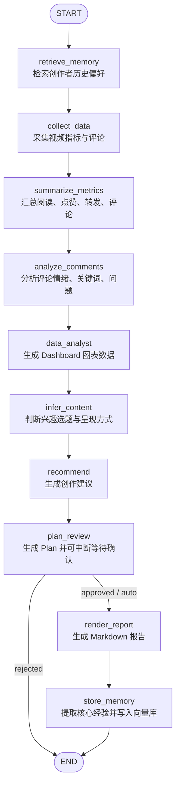
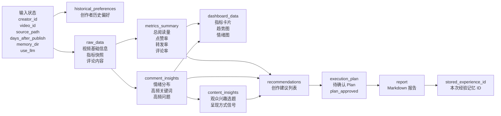

# LangGraph 可视化流程

本文档展示当前短视频复盘 agent 的 LangGraph 工作流。源码入口位于 `video_review_agent/graph.py`，对外暴露的图为 `graph = build_graph()`。

## 总览图

## 状态流转图

## 节点说明

| 节点 | 函数 | 输入 | 输出 | 说明 |
| --- | --- | --- | --- | --- |
| `retrieve_memory` | `retrieve_memory_node` | `creator_id`, `memory_dir` | `historical_preferences` | 在采集和分析前，从本地 Qdrant 向量库检索该创作者的历史复盘经验。 |
| `collect_data` | `collect_data_node` | `video_id`, `source_path`, `platform`, `days_after_publish`, `max_comments` | `raw_data` | 从 JSON mock 数据或哔哩哔哩公开数据源读取指定视频，并按发布后的天数过滤指标快照和评论。 |
| `summarize_metrics` | `summarize_metrics_node` | `raw_data` | `metrics_summary` | 计算阅读量、点赞量、转发量、评论量、互动率和增长量。 |
| `analyze_comments` | `analyze_comments_node` | `raw_data` | `comment_insights` | 提取评论情绪、高频关键词、高频问题和代表性评论。 |
| `data_analyst` | `data_analyst_node` | `raw_data`, `metrics_summary`, `comment_insights` | `dashboard_data` | 生成前端图表需要的数字 payload，包括指标卡片、热度留存走势、互动走势和评论情绪。 |
| `infer_content` | `infer_content_node` | `raw_data`, `comment_insights` | `content_insights` | 根据标题、描述和评论判断观众关注的选题与呈现方式。 |
| `recommend` | `recommend_node` | `metrics_summary`, `comment_insights`, `content_insights` | `recommendations` | 把数据表现和评论洞察转化为创作建议。 |
| `plan_review` | `plan_review_node` | `recommendations`, `metrics_summary`, `content_insights`, `historical_preferences` | `execution_plan`, `plan_approved` | 生成前端可展示的 Plan；当 `require_plan_approval=True` 时通过 LangGraph `interrupt` 暂停，等待用户确认或修改后再 resume。 |
| `render_report` | `render_report_node` | 全量状态 | `report` | 渲染 Markdown 报告；当 `use_llm=True` 时，会调用 LLM 润色报告。 |
| `store_memory` | `store_memory_node` | 全量状态 | `stored_experience_id` | 提取本次复盘核心经验，使用本地哈希向量函数写入 Qdrant。 |

## 当前设计特点

- 当前图是线性流程，便于调试和解释。
- 复盘开始先检索创作者历史偏好，复盘结束后再写入本次经验，避免当前报告被自己检索到。
- `plan_review` 支持 human-in-the-loop：前端展示 Plan，用户确认或修改后恢复执行。
- `data_analyst` 是 Dashboard 的数字出口，前端不重新计算业务指标，只负责可视化。
- 指标计算和评论分析默认是规则逻辑，不依赖 LLM。
- LLM 只在最后的 `render_report` 节点中作为可选润色步骤。
- 真实平台接入时，优先替换或扩展 `collect_data` 对应的数据采集层，不改变后续节点契约。
