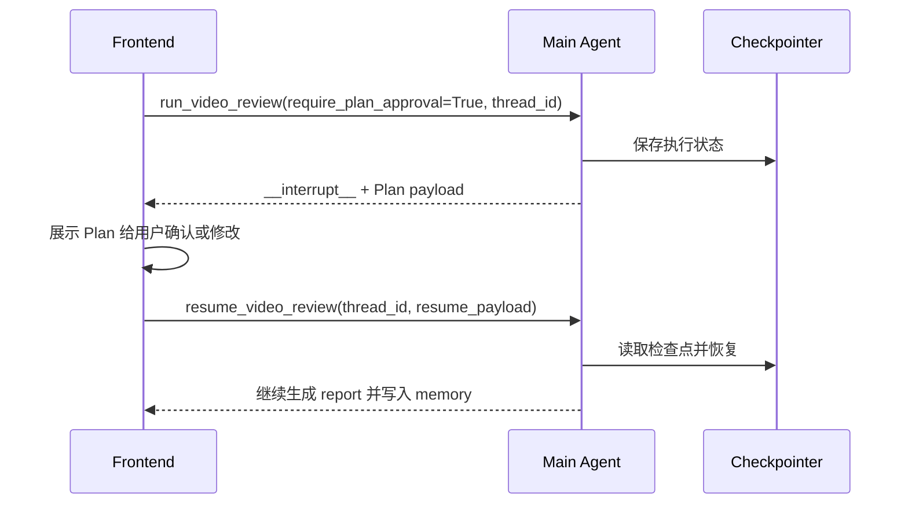

# Checkpointer 与 Plan 审批恢复

项目在 LangGraph 编译时配置了 `MemorySaver` checkpointer，用于支持 human-in-the-loop 的 Plan 审批流程。当前实现是进程内检查点，适合本地测试和常驻后端服务；如果后续需要跨进程或服务重启后继续恢复，可替换为数据库型 checkpointer。

## 工作位置

源码位于 `video_review_agent/graph.py`：

- `DEFAULT_CHECKPOINTER = MemorySaver()`
- `build_graph(...).compile(checkpointer=...)`
- `plan_review_node`
- `resume_video_review`

## 执行流程



## 中断返回

开启审批：

```python
from video_review_agent.graph import run_video_review

result = run_video_review(
    video_id="demo-video-001",
    creator_id="creator_001",
    require_plan_approval=True,
    thread_id="creator_001_demo_plan",
)
```

当图暂停时，返回值会包含：

```python
result["__interrupt__"][0].value
```

这个 value 就是前端可展示的 Plan，其中包含：

- `thread_id`
- `creator_id`
- `video_id`
- `metrics_summary`
- `comment_summary`
- `content_insights`
- `historical_preferences`
- `recommendations`

## 恢复执行

用户确认：

```python
from video_review_agent.graph import resume_video_review

final_state = resume_video_review(
    thread_id="creator_001_demo_plan",
    resume_payload={"approved": True},
)
```

用户修改建议后恢复：

```python
final_state = resume_video_review(
    thread_id="creator_001_demo_plan",
    resume_payload={
        "approved": True,
        "recommendations": [
            "下一条视频优先拆解选题判断方法。",
            "保留案例拆解结构，并放慢字幕节奏。",
        ],
        "review_notes": "用户确认后调整了两条建议。",
    },
)
```

用户拒绝：

```python
final_state = resume_video_review(
    thread_id="creator_001_demo_plan",
    resume_payload={"approved": False},
)
```

拒绝时流程会在 `plan_review` 后结束，不会继续生成报告，也不会写入本次经验记忆。

## 测试

```bash
python test/test_checkpoint_interrupt.py
```

该测试会验证：

- 图在 `plan_review` 节点返回 `__interrupt__`。
- Plan payload 包含推荐建议和 thread id。
- 使用同一 thread id resume 后，图继续生成报告。
- 用户修改后的 recommendations 会进入最终报告。
